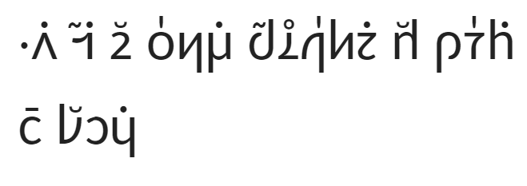

# 夏理文 v1.2 設計文檔

## 展示和示例文本

意字表

berti ::b7,e-2,r9:t4,i6:: 北
brife ::b7,r1,i-6:f4,e6:: 風
solri ::s7,o-2,l9:r4,i6:: 日
gleki ::g7,l1,e-6:k4,i6:: 悅
fanva ::f7,a-2,n9:v4,a6:: 譯
troci ::t7,r1,o-6:c4,i6:: 試
djuno ::d7,j1,u-6:n4,o6:: 知
traji ::t7,r1,a-6:j4,i6:: 最
vlipa ::v7,l1,i-6:p4,a6:: 能
litru ::l4,i-6:t7,r1,u6:: 旅
dasni ::d4,a-6:s7,n1,i6:: 着
glare ::g7,l1,a-6:r4,e6:: 熱
kosta ::k4,o-6:s7,t1,a6:: 衣
klama ::k7,l1,a-6:m4,a6:: 行
simxu ::s7,i-2,m9:x4,u6:: 互
tugni ::t7,u-2,g9:n4,i6:: 約
clira ::c7,l1,i-6:r4,a6:: 早
snada ::s7,n1,a-6:d4,a6:: 勝
gasnu ::g4,a-6:s7,n1,u6:: 致
cupra ::c4,u-6:p7,r1,a6:: 製
zenba ::z7,e-2,n9:b4,a6:: 增
rinka ::r7,i-2,n9:k4,a6:: 使
zukte ::z7,u-2,k9:t4,e6:: 作
tagji ::t7,a-2,g9:j4,i6:: 緊
dirce ::d7,i-2,r9:c4,e6:: 耀
milxe ::m7,i-2,l9:x4,e6:: 柔
glare ::g7,l1,a-6:r4,e6:: 熱
bilga ::b7,i-2,l9:g4,a6:: 必

::n7,i1,o6:l4,a6:#北:#風:j7,o1,u6:l4,a6::日
::l4,a6:: ,,::ai-:s:o:p:o:s::,,
::l4,a6:: ,,::g:l:e-:k:i::,, ::c4,u6::譯
::i:l4,a6::北風::j7,o1,u6:l4,a6::日::p4,u6::試::l4,e6:k4,a6::知::l4,e6:d7,u1,u6:m4,a6:k4,au6::最::l4,e6:k4,a6::能::v4,au6:f4,o6:l7,e1,i6:m4,e6:l4,e6:n4,ei6:: ::i:c4,a6:b4,o6:l4,e6:p4,a6::旅::n4,oi6::着::l4,o6::熱衣::c4,u6:m7,o1,u6::行
::i:l7,u1,i6:l4,e6:r4,e6:m4,ei6:p4,u6::互::l4,e6:k4,a6::約::f4,i6:l4,e6:n4,u6::最::l4,e6:k4,a6::能::f4,a6:l4,e6::最::b4,e6:l4,e6:k4,a6::早::f4,a6:l4,o6:n4,u6:c7,e1,u6::勝::l4,e6:k4,a6::致::l4,e6:n4,u6:l4,e6:p4,a6::旅::c7,o1,u6::着::l4,e6::衣
::i:b4,a6:k4,u6:l4,a6::北風::c7,o1,a6::最製::l4,e6::風 ::i:k7,u1,i6:l4,o6:n4,u6:: ::s#d6+h:b4,y6:b4,y6:s#d4+h:: 增::l4,e6:k4,a6::製::l4,e6:x4,o6:k4,au6::風::c4,u6::使::l4,o6:n4,u6:l4,e6:p4,a6::旅::c4,u6::作::l4,e6:k4,a6::增::l4,e6:k4,a6:s4,e6:l7,a1,u6:l4,i6:x4,o6:k4,au6:s4,e6::緊::l4,e6::衣 ::i:b4,a6:z4,a6:b4,o6:l4,a6::北風::c7,o1,u6::試
::i:b4,a6:k4,u6:l4,a6::日::c7,o1,a6::耀::l4,o6::柔熱 ::i:b4,a6:z4,i6:b4,o6:l4,e6:p4,a6::旅::c7,o1,u6::着::l4,e6::衣
::i:s4,e6:k7,i1,u6:b4,o6:l4,a6::北風::c7,o1,a6::必約::f4,i6:l4,o6:n4,u6:l4,a6::日::c4,u6::最::l4,e6:k4,a6::能::v4,au6:f4,o6:l4,a6::北風::c4,e6:l4,a6::日

ni'o la berti brife jo'u la solri
la .aisopos.
la gleki cu fanva
.i la berti brife jo'u la solri pu troci leka djuno ledu'u makau traji leka vlipa vau fo le'i me lenei .icabo le pa litru noi dasni lo glare kosta cu mo'u klama
.i lu'i le remei pu simxu leka tugni fi lenu traji leka vlipa fa le traji be leka clira fa lonu ce'u snada leka gasnu lenu le pa litru co'u dasni le kosta
.i baku la berti brife co'a traji cupra le brife .i ku'i lonu by.by. zenba leka cupra le xokau brife cu rinka lonu le pa litru cu zukte leka zenba leka sela'u li xokau se tagji le kosta .ibazabo la berti brife co'u troci
.i baku la solri co'a dirce lo milxe glare .ibazibo le pa litru co'u dasni le kosta
.iseki'ubo la berti brife co'a bilga tugni fi lonu la solri cu traji leka vlipa vau fo la berti brife ce la solri

[[toc]]

## 前言

2021年夏，金毛狸狗（geezmolycos / la .langer.，人名）爲 lojban 設計了一種書寫系統。金毛狸狗比較喜歡東亞文化，他當時在 [omniglot](https://www.omniglot.com/) 上面看到了很多人造的書寫系統，當時他正在學習 lojban，力求學到他當時英語的水準，可惜最後沒學到那個水準，但學習 lojban 的過程讓他的思維得到了鍛鍊，擁有了一些別樣的思維方式，還有對語言的一些別樣的認識。lojban 最後成爲了他最喜歡的人工語言。

金毛狸狗設計的書寫系統他決定命名爲「夏理文」，其中「夏」是創造出來時候的季節，又代表「華夏」之意，因爲其中使用了漢字；「理」則代表邏輯語名稱中「邏輯」的部分。金毛狸狗使用筆和草稿本於2021年春編寫了夏理文的第一版 (v1.0)，其中代表邏輯語 x 的部件形如「木」，之後，他在實驗和實踐中創作了 v1.1, 將代表 x 的部件修改成「::x::」並重新編寫了組詞規則和成文規則，使用鉛筆和A4紙編寫了一個簡單的文檔「夏理文手稿」。他本想編寫完善以後，整理好發佈到互聯網（互相聯通的網絡）上，但是後來因爲沒有學習編譯原理，他在設計最後一部分「文字使」的時候，因爲沒有理論指導，無法有效設計，無限期延遲了文檔完成。最後，在2025年2月他整理物品時翻到了未完成的手稿，決定將其簡單拍攝成pdf文檔後，發佈在「中國邏輯語社區」QQ群中，後來得到了一定的反響和支持。在群友的幫助下，金毛狸狗，對現代 lojban （分裂）的形態學和各種改革提案更新了認識。於是在內驅力達到閾值後，2025年12月12日他決定編寫一篇內容更詳盡，更適合大衆參考使用的夏理文文檔，這個時候也應該做一些小改動，增加一些新的內容，去掉一些過時內容。

## 簡介

夏理文是一種實驗性的書寫系統，專爲 lojban 設計，是一種全音素表音文字（夏理構字）和漢字混合的書寫系統，類似當今用來書寫日語的漢字假名混寫；其中表音部分按照音節呈塊狀拼寫，類似朝鮮半島地區使用的諺文。夏理文是一種新創造的書寫系統，雖借鑑漢字、假名、諺文書寫系統特徵，但卻爲 lojban 量身定製，且從頭開始設計。夏理文是一種比較複雜的書寫系統，其組織好的文本可以視作一個層次結構，每個層級都有一系列的要素和規則，自底向上由基本部件和符號，依據每層級的規則組織成更大的結構，最後排版成爲完整的文本。

本文是一個設計文檔，會從設計者「金毛狸狗」的角度詳盡介紹這個書寫系統和其中的每個部分，還會介紹每個部分的設計思路，並給出一些例子方便讀者使用這個書寫系統。本文不是一部教程，因爲金毛狸狗暫時沒有精力去編寫教程，但是也可以看這個來學習。本文主要分爲三大部分：

- 首先，考慮到夏理文的複雜性（它不是 lojban Latin 書寫系統的一個簡單類比），我們爲了方便表示出夏理文的自由裁量權，制定了一種 lojban 夏理 Latin 正字法，而不是直接使用通用的 Latin 書寫系統表示 lojban，這樣可以避免一般討論 lojban 時使用 Latin 書寫系統的一些缺陷和其中實現上的一些細節問題（例如半元音表示）。
- 其次，本文將會自底向上詳盡介紹夏理文的各個組成部分。這是本文篇幅最多的部分。這部分中也會寫出作者的設計思路，並給出一定數量的示例，便於讀者理解。
- 然後，本文將會把夏理文的組成簡單地自上而下介紹一下，以便於完善思路，也能指導怎麼閱讀，而不是編寫夏理文文本
- 最後，本文將提出夏理文文本的一種 Latin 轉寫，力求主要使用 Latin 字母，比較簡單線性地唯一表示任何合法夏理文文本，以方便計算機解析。

lojban 已經在不同群體和情況下演化了很長時間，在 CLL lojban 以後，又不斷有提案，魔改和野外用法改變這個語言，在形態學上 lojban 也不能避免這樣的演變。夏理文的設計主要是爲比較現代的 lojban 形態學設計的，但是我的精力和能力不足以構建出一個完整的定義，什麼是現代的 lojban 形態學。因此，這個文章的內容，如果能用就是能用，不能用，那可能就是不能用，讀者需要自己考慮。夏理文也會兼容一些對 lojban 形態學的擴展，例如 輔音-半元音-元音 的音節結構，例如 eu 雙元音，以供讀者更自由地使用。

## lojban 夏理 Latin 正字法

計算機視角下的 lojban 文本所代表的本質就是一系列分開的詞語（詞語列表），而我們人在使用 lojban 的時候，具體到聽、說、讀、寫，在說和寫的時候是有一定的自由裁量權的。就寫來說 lojban Latin 書寫系統是比較鬆弛的，同樣的文本，有的地方可以自由選擇一些寫法，不同的人有不同的書寫習慣，例如：

> la .alis.andyrsyn. cu pu'o citka lo nimre .i lonu citka cu cfari ca lo prulamdei

> la .alis. .andyrsyn. cu pu'o citka lo nimre .i lo nu citka cu cfari ca lo prulamdei

甚至

> la.alis.andyrsyn.cupu'ocItkalonImre.ilonucItkacucfAricaloprulAmdei

這些對同一個文本的不同寫法，都是等價且合法的，這些寫法都表示同樣的一個分詞結果，都代表着一系列在分詞上等價的語音流。不影響計算機解析結果，也不影響閱讀者接收的結果（可能會影響閱讀的困難程度，但是對於一個理性的閱讀者來說，它分析出的文本結構不會變化）。

lojban 的說話系統也是相對松馳的，例如上文的 `lo nu citka` 中間就可以完全不停頓讀作 `lonuCITka`，也可以每個詞都停頓一下讀作 `lo.nu.CITka`，甚至重音有的地方也是可以自由裁量的，例如這個 `lo nu citka` 如果完全不停頓可以讀爲 `LOnuCITka` 或 `lonuCITka`，並不影響聆聽者接收的分詞結果。

lojban 表示法的在 Latin 書寫系統或發音上的自由裁量權，與夏理文允許的自由裁量權有不同之處，我們直接制定一種變體的 Latin 正字法（稱爲夏理 Latin 正字法），從 lojban 詞語列表出發，在通用 Latin 正字法的基礎上，僅包括夏理文需要使用的自由裁量權（包括雙元音被視作整體還是分開，分詞需要的重音和停頓等），這樣有利於我們後面爲夏理文制定規則時準確說明，也在後面設計夏理文 Latin 轉寫時有用。

從 lojban 詞語列表出發，我們認爲，每個詞語由許多音素組成，包括含y單元音、雙元音、半元音、輔音、h音（y'y 即 Latin 正字法中的撇號）幾類，其中含y單元音、雙元音可以是重音或非重音。每類音素包括（寫作通用 Latin 正字法的表示）：

- 含y單元音：a e i o u y
- 雙元音：ai ei oi au
- 半元音：i u
- 輔音：p b t d k g f v s z c j x m n l r
- h音：'

這些音素在我們的正字法中對應寫作：

- 含y單元音：a e i o u y
- 雙元音：ą ę ǫ a̮
- 半元音：ɩ ,,(latin iota),, ʊ ,,(latin upsilon),,
- 輔音：p b t d k g f v s z c j x m n l r
- h音：'

其中雙元音的字符僅對應被視作整體的雙元音，例如 cmavo 中的雙元音。形態學上分開的雙元音可寫作 aɩ eɩ oɩ aʊ，例如 rafsi 的雙元音。雖然這樣說，但是這不影響文本解析，只是一種風格上的建議。

詞語的語音組合法(phonotactics)這裡不涉及，但是我們可以認爲你使用的 lojban 方言的語音組合法適用。分詞方法這裡也不涉及，也是認爲已經有一個分詞方法了。

之後就是詞語的形態學重音，重音非重音是某個具體實現，其中的每個字母的重音與否是根據實際（分詞方法）得到的，而不是給定一系列空格（停頓）分開的詞語，問哪個字母能重音。也就是說這不是和 lojban 詞語列表一一對應，而是根據具體情況具體書寫。至於 cmevla，重音不影響形態學分詞，因此 cmevla 的重音如果有，均要顯式寫明。CLL 中倒數第二個音節（是否跳過y存疑）重音的規則在此不適用，如果重音必須顯式寫出。形態學重音我們使用附加銳音符 ◌́(acute) 表示，優先使用 unicode 分離形式（Normalization Form D），如下：

- 含y單元音：á é í ó ú ý
- 雙元音：ą́ ę́ ǫ́ á̮

最後，詞語中形態學的非重音如果要強調，我們使用附加鈍音符 ◌̀(grave)表示，但是也可以不寫，不寫默認就是非重音，如下：

- 含y單元音：à è ì ò ù ỳ
- 雙元音：ą̀ ę̀ ǫ̀ à̮

最後是停頓，我們使用空格表示形態學上可選的實際停頓。對空格的用法，我們只關注是否在使用語言時實際停頓了，例如用夏理文記錄說話語音流中實際的停頓，或者在書寫時追求某種特定文字風格。如果實際上沒有停頓，則不使用空格，直接連寫。

我們也要考慮點號，點號在通用 Latin 正字法中表示形態學上必須有的停頓（我們認爲喉爆發音(ʔ, glottal stop)和停頓是一回事），而在夏理 Latin 正字法中，點號是一個可選的東西，可有可無。如果有，它與空格是等效的。點號可以根據具體使用者的需求而確定用途，例如像通用 Latin 正字法一樣表示形態學上必須有的停頓，或者只用來標記特定的詞類（如只用來環繞 cmevla），這個是具體的夏理文上層規則中需要涉及到的。

總得來說，重音信息、停頓信息、點號信息，都是爲了分詞算法服務的。

下面是一些使用夏理 Latin 正字法和通用 Latin 正字法，表示同樣的詞語列表的對比：

| | |
|-|-|
| 通用 | .i do mi prami .i mi do prami .i la .micuueBIN.tcyn. titla melbi |
| 夏理 | idomipra+'+mi imidopra+'+mi ila micuʊebín tcyn títlamélbi |
| 夏理 | i do mi prami i mi do prami i la.micu+u+e+'+bin.tcyn.titla melbi |

 

| | |
|-|-|
| 通用 | do dicra .e'a mi ca la .daucac. bi'onai la .gaicac. |
| 夏理 | do dícra e'a mi ca la dá̮cac bi'oną la gą́cac |

 

| | |
|-|-|
| 通用 | loi sodvrkokakola cu mo'i farlu le boltipyboi le ti botpi |
| 夏理 | lǫ sodvrkokakóla cu mo'i fárlu le boltípyboɩ le ti bótpi |

## 夏理文書寫系統層級結構及定義

夏理文書寫系統由衆多層級組成，它基本上是一個自頂向下的金字塔結構。如下圖所示，頂層的夏理文是由下層的結構逐級按照規則組織而成的。組織好的夏理文文本，可以視作一個層次結構，由基本部件、符號等依據每層級的規則逐步組成更大的結構，最終排版成完整的文本。整個體系的基礎是我們上一節中規定的夏理 Latin 正字法，我們從 Latin 正字法表示的文本內容出發，使用各種部件按規則構成夏理文文本。

夏理文書寫系統自下而上，首先是基本部件，包括

- 組成構字的構枝、構幹：
- 組成意字的漢字、意字葉、意字花
- 組成各標點子系統的各部件

其中，構字是夏理文的表音文字部分，意字是夏理文假借漢字的部分，而標點子系統，包括普通標點、輔株、韻符、訓字，則是夏理文整體運作的一些補充成分。構枝、構幹分別爲代表輔音、元音的基本部件。意字葉是確定假借漢字 rafsi 形式的修飾符，意字花是確定假借漢字形成 lujvo 時標準化形式的修飾符，各標點子系統會在之後詳細介紹。

構字和意字兩種子系統，受組詞規則的支配，組成詞語。夏理文的組詞規則包括一系列可選的範式，分別適用於不同的詞語風格要求，可以按照習慣將他們對應於不同的 lojban 詞類。詞語依據成文規則形成素文，即不含標點的文本。標點不影響文本解析爲詞語列表，素文即可被無歧義解析。素文和各標點子系統結合爲完整的夏理文書寫系統。

完整的夏理文書寫系統還對應了其 Latin 轉寫，便於線性地分析夏理文文本。這些內容將會在之後的章節中詳細介紹。

### 名稱表

下面是夏理文中各概念的漢語名稱、英語名稱、lojban 名稱表：

| 漢語名稱 | 英語名稱 | lojban 名稱 |
| - | - | - |
| 夏理文 | Aestivologica script | cislojlerci'e |
| Latin 正字法 | Latin orthography | glilermo'a |
| 夏理 Latin 正字法 | Aestivologic Latin orthography | cislojglilermo'a |
| 構枝 | compositional branch | stura jimca |
| 構幹 | compositional trunk | stura stani |
| 立式 | vertical form | sraji |
| 臥式 | horizontal form | pinta |
| 構字 | compositional character | stura lerfu |
| 平株 | plain construct | sampu turselzba |
| 漢字 | Chinese character | jugle'u |
| 意字葉 | logogram foliage | smule'u pezli |
| 意字花 | logogram blossom | smule'u xrula |
| 意字 | logogram | smule'u |
| 株 | construct | selzba |
| 詞語 | word | valsi |
| 素文 | basic text | jadyca+u+ vlame+i+ |
| 標點 | punctuation mark | padle'u |
| 輔株 | auxiliary construct | sidju selzba |
| 韻符 | tone mark | togle'u |
| 訓字 | assigned logogram character | krati smule'u |
| 夏理文 Latin 轉寫 | Latin transliteration for Aestivologica script | lo xe lerfanva be fi le glico be+,+ la cisloj |

#### 構字株名稱

| 漢語名稱 | 英語名稱 | lojban 名稱 |
| - | - | - |
| 泛單株 | generic singular construct | fadni pamei turselzba |
| 泛終株 | generic final construct | fadni fanmo turselzba |
| 泛間株 | generic interposed construct | fadni midju turselzba |
| 疊幹株 | stacked trunk construct | rapli stani turselzba |
| 疊二株 | stacked double constuct | rapli remei turselzba |
| 長終株 | long final construct | clani fanmo turselzba |
| 長間株 | long interposed construct | clani midju turselzba |
| 根終株 | gismu final construct | gismu fanmo turselzba |
| 根間株 | gismu interposed construct | gismu midju turselzba |

#### 意字葉及意字花名稱

| 漢語名稱 | 英語名稱 | lojban 名稱 |
| - | - | - |
| 終葉 |  |  |
| 間葉 |  |  |
| 單葉 |  |  |
| 雙葉 |  |  |
| 長葉 |  |  |
| 本葉 |  |  |

#### 規則範式名稱

| 漢語名稱 | 英語名稱 | lojban 名稱 |
| - | - | - |
| 平詞範式 | plain word normal form (PWNF) | jvamapti le sampu valsi |
| 泛詞範式 | generic word normal form (GWNF) | jvamapti le fadni valsi |
| 複構詞範式 | compound compositional word normal form (CCWNF) | jvamapti le selpau stura valsi |
| 複葉詞範式 | compound foilaged word normal form (CFWNF) | jvamapti le selpau pezli valsi |
| 複花詞範式 | compound blossomed word normal form (CBWNF) | jvamapti le selpau xrula valsi |
|  |  |  |
| 平文範式 | plain textual normal form (PTNF) | jvamapti le sampu vlamei |
| 泛文範式 | generic textual normal form (GTNF) | jvamapti le fadni vlamei |
| 構文範式 | compound textual normal form (CTNF) | jvamapti le selpau vlamei |
| 葉文範式 | foliaged textual normal form (FTNF) | jvamapti le pezli vlamei |
| 花文範式 | blossomed textual normal form (BTNF) | jvamapti le xrula vlamei |

### 符號表

爲了方便下文討論，在這裡定義一些用到的符號和縮寫

| 符號或縮寫 | 全稱 | 解釋 |
| - | - | - |
| \<V> | 含y單元音(Vowel) | 包括 a e i o u y，無論重音形式 |
| \<V+'+> | 含y單元音重音形式 | 包括 a+'+ e+'+ i+'+ o+'+ u+'+ y+'+ |
| \<V+"+> | 含y單元音非重音形式 | 包括 a+"+ e+"+ i+"+ o+"+ u+"+ y+"+ |
| \<V\\y> | 不含y單元音 | 包括 a e i o u，無論重音形式 |
| \<D> | 雙元音(Diphong) | 包括 a+,+ e+,+ o+,+ a+.+，無論重音形式 |
| \<D+'+> | 雙元音重音形式 | 包括 a+,++'+ e+,++'+ o+,++'+ a+.++'+ |
| \<D+"+> | 雙元音非重音形式 | 包括 a+,++"+ e+,++"+ o+,++"+ a+.++"+ |
| \<G> | 半元音(Semivowel/Glide) | 包括 +i+ +u+ |
| \<C> | 輔音 | 包括 p b t d k g f v s z c j x m n l r |
| \<CG> | 輔音和半元音 | 包括所有輔音和半元音 |
| \<CGh> | 含h輔音和半元音 | 包括所有輔音、半元音、h音 |
| \<CGh.> | 含h和.輔音和半元音 | 包括所有輔音、半元音、h音、點號（停頓/喉爆發音） |
|  |  | 上述項的排列組合可自行推斷含義 |

## 構字部件

構字是夏理文的表音文字部分，是全音素表音文字，每一個音素都要完整寫出。構字的基礎是部件。部件是構字中的最小單位，不可再分。一個構字部件表示一個音素。基礎的構字部件分爲兩類，一類叫作「構枝」，包含\<CGh.>（輔音類音素），另一類叫作「構幹」，包含\<VD>（元音類音素）。各部件列舉在下面兩小節。

### 構枝

構枝是構字部件中用來表示\<CGh.>類音素的。所有構枝字形的列表爲：

| | | | | |
|-|-|-|-|-|
|   p      b   |   t      d   |              |   k      g   |   .   |
| ::p::  ::b:: | ::t::  ::d:: |              | ::k::  ::g:: | ::q:: |
|   f      v   |   s      z   |   c      j   |   x          |   '   |
| ::f::  ::v:: | ::s::  ::z:: | ::c::  ::j:: | ::x::        | ::h:: |
|   m      n   |   l      r   |              |  +i+    +u+  |       |
| ::m::  ::n:: | ::l::  ::r:: |              | ::ii::  ::uu:: |       |

| |
|-|
| 0 1 |
| ::0::  ::8:: |

0: 代表未標記的空構枝，不對應音素。代表空的音素，用途爲填充空位，或用於輔株。
1: 代表標記的空構枝，不對應音素。

構枝可以佔據 1x1 株大小（全角），也可以佔據 0.5x1 或 0.5x0.5 株大小（左右半角、小角），在合法但不規範的情況下也可以佔據 1x0.5 株大小（上下半角）。這將會在「構字株」一節中詳細解釋。下面是一個例子：

全角：^^::corner#full,t::^^ 左右半角：^^::corner#full,t4,t6::^^ 小角：^^::corner#full,t7,t1,t9,t3::^^ （上下半角：^^::corner#full,t8,t2::^^）

各部件的起名方式是「構枝 {輔音名稱}」，例如 ::s:: 叫作「構枝 s」或「me me'o sy. stura jimca」。
空構枝的名稱叫作「空構枝」或「sucta stura jimca」，未標記和標記變體分別稱作「未標記空構枝」或「na'e tcita sucta stura jimca」，「標記空構枝」或「tcita sucta stura jimca」

### 構幹

構幹是構字部件中用來表示\<VD>類音素的，所有構幹字形的列表爲：

| | | | | | | | | | | | |
|-:|-|-|-|-|-|-|-|-|-|-|-|
|            |   a    |   e    |   i    |   o    |   u    |   y    |  |   ai    |   ei    |   oi    |   au    |
| 立式       | ::a0:: | ::e0:: | ::i0:: | ::o0:: | ::u0:: | ::y0:: |  | ::ai0:: | ::ei0:: | ::oi0:: | ::au0:: |
| 立式(重音) | ::a-0::| ::e-0::| ::i-0::| ::o-0::| ::u-0::| ::y-0::|  | ::ai-0::| ::ei-0::| ::oi-0::| ::au-0::|
| 臥式       | ::a::  | ::e::  | ::i::  | ::o::  | ::u::  | ::y::  |  | ::ai::  | ::ei::  | ::oi::  | ::au::  |
| 臥式(重音) | ::a-:: | ::e-:: | ::i-:: | ::o-:: | ::u-:: | ::y-:: |  | ::ai-:: | ::ei-:: | ::oi-:: | ::au-:: |

| | | |
|-:|-|-|
|            | 0 | 1 |
| 立式       | ::10::  | ::1-0::|
| 臥式       | ::1::   | ::1-:: |

0: 代表未標記的空構幹，不對應音素。代表空的音素，用途爲填充空位，或用於輔株。
1: 代表標記的空構幹，不對應音素。

構幹可以佔據 1x1 株大小（全角）或 0.5x0.5 株大小（小角），構幹分爲立式和臥式兩種形式，還分爲重音與非重音變體。立式構幹可以佔據 0.5x1 株大小（左右半角），在合法但不規範的情況下還可以佔據上下半角，而臥式構幹可以佔據 1x0.5 株大小（上下半角），或在疊幹株的左半邊佔據 0.5x1 株大小（左半角）。構幹的兩種形式是服務於不同結構的構字株的，將會在後面詳細說明。

立式：全角：^^::corner#full,e0::^^ 左右半角：^^::corner#full,e4,e6::^^ 小角：^^::corner#full,e07,e01,e09,e03::^^ （上下半角：^^::corner#full,e08,e02::^^）

臥式：全角：^^::corner#full,e::^^ 上下半角：^^::corner#full,e8,e2::^^ 小角：^^::corner#full,e7,e1,e9,e3::^^ （左右半角：^^::corner#full,e04,e06::^^）

各部件的起名方式是 「構幹 {重音}{立式/臥式}{元音/雙元音名稱}」，例如 ::u-:: 叫作「構幹 重音臥式u」 或 「terbasna pinta me me'o ubu stura stani」。
空構幹的名稱叫作「空構幹 {立式/臥式}」或「{sraji/pinta} sucta stura stani」，未標記和標記變體分別稱作「未標記空構幹 {立式/臥式}」或「{sraji/pinta} na'e tcita sucta stura stani」，「標記空構幹 {立式/臥式}」或「{sraji/pinta} tcita sucta stura stani」

### 構字部件設計原則

根據上面那個「株」的類比，「構枝」「構幹」它們的名字解釋了他們的地位和設計風格。在組合構字株中，構枝是依附於構幹存在的，因爲輔音一般需要跟隨元音存在。構枝的筆畫總體以斜線爲主，而構幹的筆畫總體以直線爲主，且外形相對細長，以便設計立式、臥式兩種形式，且讓組合時壓縮變形不丟失細節。我在設計構枝的字形時，是將不同屬性的幾組分別設計的。首先我借鑑了 [zbalermorna](https://jackhumbert.github.io/zbalermorna/write-up/) 的字形設計的對稱性，zbalermorna 是另一種爲 lojban 設計的書寫系統，它的文本總體風格比較類似帶附標的 Latin 字母。

這種書寫系統是一種元音附標文字，它的輔音是基礎字母，元音是輔音上附加的標記。其中輔音字母它的字形設計，成對的清濁輔音，字形互爲180度對稱，且爆發音 (stop) 、（無噝）擦音 (fricative)、有噝擦音（sibilant）這三種類別的輔音字形伸出的主幹處在不同位置，特徵相似的輔音其字形上有共通之處。夏理構字部件也借鑑了這個設計特徵，輔音我先分爲了爆發音、擦音、鼻音及（邊）近音三類，每組其中又有若干對清濁輔音，鼻音和（邊）近音沒有清濁屬性，則仿照 zbalermorna 將其手動組成對。

首先，爆發音和擦音的字形設計，先由清爆發音開始。p/t/k 三者字形重心依次靠下，且三者最下方均不足兩個伸展的筆畫，而是爲撇/橫/點這樣的筆畫，象徵着爆發音的阻塞，也讓人聯想到諺文的 ㄱ ㅋ 等字母。爆發音和相同部位的擦音對應的輔音字形大致互呈180度翻轉對稱。例如 p (::p::) 和 f (::f::) 字形互爲180度對稱。f/s/c/x 重心對應依次提高，且 f/s/c 下方均有兩個伸展的筆畫，其字形與諺文的 ㅅ ㅈ ㅊ 等（塞）擦音類似。濁音是由清音增添一個筆畫構成的，增添的筆畫首先考慮在中間增添橫線，如果不適合書寫，則在末端增添一個點，或在首端增加一個撇。

其次，鼻音及（邊）近音的字形設計是以 l 爲基礎的，使用注音字母 ㄌ 的字形，漢語「力」字的聲母得到的啓發，由於 m/n/l/r 這四個輔音之間沒有明顯的對立關係，我就將這個字形旋轉、翻轉，形成四個互相對稱或旋轉對稱的字形。

停頓和 h 音這兩個音素，是仿照爆發音和擦音的對立關係創建的，其中停頓的 ::q:: 字形更尖銳，而 h 音字形 ::h:: 稍緩和。這兩個字形比較少強制使用，一般在排版過程中會被排版規則省略掉。但是如果需要直接討論音素或字母本身，或者應用在 cmevla 中，這兩個字形還是會被使用到的。

半元音 +i+ 和 +u+ 字形設計爲 ::ii:: 和 ::uu::，與輔音和元音均不同，這是爲了與普通的輔音、元音區分開，表明它在形態學上的特殊地位。

元音字形在設計時，以立式爲例，首先每個元音均有一條豎線作爲主幹和基礎，然後，根據元音發音部位的不同，各字形和發音部位有一定的對應關係：

| | | | |
|:-:|:-:|:-:|:-:|
|    |  前    |  央    |  後    |
| 高 | ::i0:: |        | ::u0:: |
| 中 | ::e0:: | ::y0:: | ::o0:: |
| 低 | ::a0:: |        |        |

具體來說，就是前元音都是由一條主幹和若干橫線組成，後元音有兩條豎線，央元音只有 y 一個元音，爲 ::y0:: 形，高元音特性爲於中央，低元音位於上方。
重音以元音末尾的鉤表示。

最後，考慮到書寫方便，每個字形在書寫時均能使用三個筆畫以內寫出，且笔画符合中文书写习惯，例如没有向左、向上的笔画。這些字形沒有強制規定的筆順，可以參照一般中文的習慣寫法。

## 構字株

構字株是由若干個部件按照一定排列規則組成的一個字，一般佔一個漢字大小。一個構字株由若干個構字部件組成，根據情況不同，一個株可以代表語音的一個音節，或者一個音素等。部件和株的關係基本上可類比於諺文的部件（字母）和音節的關係。「株」的概念不只適用於構字，它是一個通用的代表「大約一個漢字大小」完整字符的名稱。不同的組合方式可以用來表示不同的音節結構，且不同的組合方式也是用來適應不同的詞語類型，不同的形態學情況的。這些更高層的規則將會在後面章節中詳細介紹。本節將先枚舉常用的（規範的）的構字株組合結構，以及它們所代表的音節（音素序列），然後再敘述構字株組合和其代表音素系列的通用規則，可以涵蓋規範和不規範的任意合法組合形式。

下面表格每行爲一種構字株組合結構，每個結構圖示（「結構」列）中有若干個字母，每個字母代表一個部件，其整個株代表的音素序列如「代表」列所寫，每個字母的部件有一定的取值範圍，在「部件組成」列中列出。結構圖示中的字母如果加下劃線，該處部件若有立式臥式之分別，則寫作臥式，若無下劃線，則寫作立式。

@def{cons}{

  
{0}

}
@def{cons46}{

  
{0}

  
{1}

}
@def{cons82}{

  
{0}

  
{1}

}
@def{cons716}{

  
{0}

  
{2}

  
{1}

}
@def{cons729}{

  
{0}

  
{2}

  
{1}

}
@def{cons183}{

  
{1}

  
{0}

  
{2}

}
@def{cons439}{

  
{0}

  
{2}

  
{1}

}
@def{cons7193}{

  
{0}

  
{2}

  
{1}

  
{3}

}
@def{cons7139}{

  
{0}

  
{3}

  
{1}

  
{2}

}
@def{cons5}{

  
{0}

}

| 名稱 | 結構 | 表示 | 部件組成 |
| - | - | - | - |
| 平株 | @call{cons}{<u>A</u>}{bigger} | A | A: \<VDCGh.> |
| 泛單株 | @call{cons46}{<u>A</u>}{<b>B</b>}{bigger} | A<b>B</b> | A: \<CGh.> <b>B</b>: \<VD> |
| 泛終株 | @call{cons716}{<u>A</u>}{<u>B</u>}{<b>C</b>}{bigger} | AB<b>C</b> | A: \<CGh.> B: \<CGh.> <b>C</b>: \<VD> |
| 泛間株 | @call{cons729}{A}{<u><b>B</b></u>}{C}{bigger} | A<b>B</b>C | A: \<CGh.> <b>B</b>: \<VD> C: \<CGh.> |
| 疊幹株 | @call{cons46}{<u><b>A</b></u>}{<b>B</b>}{bigger} | <b>A</b>'<b>B</b> | <b>A</b>: \<VD> <b>B</b>: \<VD> |
| 疊二株 | @call{cons716}{<u>A</u>}{<u><b>B</b></u>}{<b>C</b>}{bigger} | A<b>B</b>'<b>C</b> | A: \<CGh.> <b>B</b>: \<VD> <b>C</b>: \<VD> |
| 疊三株 | @call{cons716}{<u>A</u>}{<u><b>B</b></u>}{<b>C</b>}{bigger}@call{cons5}{<u><b>D</b></u>}{bigger} | A<b>B</b>'<b>C</b>'<b>D</b> | A: \<CGh.> <b>B</b>: \<VD> <b>C</b>: \<VD> <b>D</b>: \<VD> |
| 疊(n)株 | @call{cons716}{<u>A</u>}{<u><b>B</b></u>}{<b>C</b>}{bigger}@call{cons5}{<u><b>D</b></u>}{bigger}@call{cons5}{<u><b>...</b></u>}{bigger} | A<b>B</b>'<b>C</b>'<b>D</b>'<b>...</b> | A: \<CGh.> <b>B</b>: \<VD> <b>C</b>: \<VD> <b>D</b>: \<VD> <b>...</b> |
| 長終株 | @call{cons7139}{<u>A</u>}{<u>B</u>}{<b>C</b>}{D}{bigger} | AB<b>C</b>D | A: \<CGh.> B: \<CGh.> <b>C</b>: \<VD> D: \<CGh.> |
| 長間株 | @call{cons7193}{A}{<u><b>B</b></u>}{C}{D}{bigger} | A<b>B</b>CD | A: \<CGh.> <b>B</b>: \<VD> C: \<CGh.> D: \<CGh.> |
| 根終株 | @call{cons7139}{<u>A</u>}{<u>B</u>}{<b>C</b>}{D}{bigger}@call{cons5}{<u><b>E</b></u>}{bigger} | AB<b>C</b>D<b>E</b> | A: \<CGh.> B: \<CGh.> <b>C</b>: \<VD> D: \<CGh.> <b>E</b>: \<VD> |
| 根間株 | @call{cons7193}{A}{<u><b>B</b></u>}{C}{D}{bigger}@call{cons5}{<u><b>E</b></u>}{bigger} | A<b>B</b>CD<b>E</b> | A: \<CGh.> <b>B</b>: \<VD> C: \<CGh.> D: \<CGh.> <b>E</b>: \<VD> |

例如：ge+'+rku 可以寫爲 ::corner#full,g:corner#full,e-:corner#full,r:corner#full,k:corner#full,u::，或者 ::corner#full,g7,e-2,r9:corner#full,k4,u6:: 等形式。djarspage+'+ti 可以寫作 ::corner#full,d7,j1,a6:corner#corner1,r5+h:corner#full,s7,p1,a6:corner#full,g4,e-6:corner#full,t4,i6::

上表列出了規範的（常用的）構字株組合結構，這只是後面詞語範式和文本範式所會用到的一個子集。實際上，構字株的組合形式只要按照下面的規則，可被解析爲音素串，那就是合法的構字株。具體的規則爲：

定義一個構字株爲 1x1 漢字大小的部件組合體（也可以沒有，只由下標構成），再加若干個基線對齊（下標） 0.5x0.5 漢字大小的部件。其中 1x1 漢字大小的部件組合體，可以由 1x1, 1x0.5, 0.5x1, 0.5x0.5 這幾種大小的部件組合而成，且必須要填滿 1x1 大小的空間。後面加的基線對齊 0.5x0.5 漢字大小部件，可以有任意多個。

@call{cons}{主}{bigger}@call{cons5}{附}{bigger}@call{cons5}{附}{bigger}@call{cons5}{...}{bigger}

主體部分，不同的組合方式有不同的解析順序，而附加部分，每一個部件按照順序依次解析。主體部分所有的組合方式對應的解析順序如下表，部件的立式和臥式任意，不影響解析，含義相同。但加下劃線的字母，代表此處臥式是更自然的寫法，不加下劃線則立式是更自然的寫法：

| 結構 | 表示 | 部件組成 |
| - | - | - |
| @call{cons}{<u>A</u>}{bigger} | A | A: \<VDCGh.> |
| @call{cons46}{<u>A</u>}{B}{bigger}, @call{cons82}{<u>A</u>}{<u>B</u>}{bigger} | AB | A: \<VDCGh.> B: \<VDCGh.> |
| @call{cons716}{<u>A</u>}{<u>B</u>}{C}{bigger}, @call{cons729}{A}{<u>B</u>}{C}{bigger}, @call{cons183}{<u>A</u>}{<u>B</u>}{<u>C</u>}{bigger} | ABC | A: \<VDCGh.> B: \<VDCGh.> C: \<VDCGh.> |
| @call{cons439}{<u>A</u>}{<b>B</b>}{C}{bigger} | A<b>B</b>C | A: \<VDCGh.> <b>B</b>: \<VD> C: \<VDCGh.> |
| @call{cons439}{<u>A</u>}{C}{B}{bigger} | ABC | A: \<VDCGh.> B: \<VDCGh.> C: \<CGh.> |
| @call{cons7139}{<u>A</u>}{<u>B</u>}{<b>C</b>}{D}{bigger} | AB<b>C</b>D | A: \<VDCGh.> B: \<VDCGh.> <b>C</b>: \<VD> D: \<VDCGh.> |
| @call{cons7193}{A}{<u>B</u>}{C}{D}{bigger} | ABCD | A: \<VDCGh.> B: \<VDCGh.> C: \<VDCGh.> D: \<CGh.> |

解析完成以後，生成一個音素序列，此時將連續的 \<VD> 音素中間添加 '，即可得到該構字株所代表的音素串。

### 構字株組合結構設計原則

構字株的組合結構，在設計上考慮了視線的運動方向。夏理文是橫向書寫，先從左到右，再從上到下。

- 每種組合結構中的各部件，按照順序掃視觀看，視線可以向下、向右、向右下移動，也可以向右上移動，只有一種情況向正上移動，但是不會向左移動。
- 先按照從左往右的順序解析部件
- 如果兩個部件縱向中心位置相同（一上一下對齊），則這兩個部件從上到下緊跟着解析（結合優先級高）
- 上一條規則有一個例外情況，若右側是兩個小角部件，且右下角爲 \<VD>，則右側兩個部件先解析下方再解析上方

第一到三條是爲了無論使用什麼部件結合的方式，其視覺觀感順序大致一樣，和線性排列也類似，能給人一個如何排列部件的直覺。最後一條的原因是要處理長終株/根終株，在這個前提下，不想讓構幹出現在上方。

## 意字株

意字是夏理文假借漢字來表示 lojban 詞語的部分，意字子系統通過組合漢字與意字葉、意字花，能夠用漢字表示 gismu, rafsi 等音素串。

這節會列出漢字、意字葉、意字花都有哪些，是如何書寫的。意字株是如何構成的，意字株如何對應音素串，如何解析。花林是如何構成的，花林如何對應因素串、如何解析。

### 漢字

漢字是一種語素文字，是由黃河流域文明華夏族發明的一種文字。在夏理文意字子系統中，一部分漢字被指定用來表示 lojban 的 gismu （或其他類型的詞語），以及這些詞語所對應的 rafsi。每個漢字對應一個詞語及其 rafsi，通過意字葉或意字花決定這個漢字代表的是詞語本身或若干個 rafsi 中的哪一個。

首先，lojban 中的每個 gismu 都對應一個（或若干個）漢字，組成意字表。lojban 本身的詞源中有中文，但是其質量不佳，因此夏理文選擇考慮漢字的歷史含義和當前含義，爲每一個 gismu 都指派一個漢字，形成意字表。目前這項工作還未完成，完成後將會發佈在此文檔中。現在我們可以假設每個 gismu 均有一個對應的漢字，本文用到的例子，其臨時指派的意字表會寫到旁邊。此外，根據每個人具體使用目的的不同，實際使用中也可以指派漢字對應其他類型的詞，如 cmavo，zi'evla 等。但是一個漢字作爲基本單位，只能對應一個詞（及其 rafsi）。對這些應用場景，在後面也會詳細解釋。

總之，一部分漢字被假借，每個漢字對應一個詞語（主要爲 gismu）和若干個 rafsi。

漢字在書寫時與一個構字株（無附加部分）大小相同，與構字株基線對齊。

### 意字葉

意字葉是用來標記漢字所表示的音素串具體是哪個的，一個漢字本身有歧義性，可能對應一個詞本身或其任意一個 rafsi，而意字葉就是用來指定漢字具體對應的是哪個形式。lojban 中的詞語對應的 rafsi 有 CCV, CVC, CVG(=CD), CV'V, CVCC, CCVC 幾種形式的，每種 rafsi 形式，以及詞語本身，都有一個對應的意字葉代表這種形式。且表示每個形式的意字葉還有重音變體，用來標記其中的某個元音爲重音。所有意字葉的字形如下表：

| 名稱 | 字形 | 頂標形式 | 上標形式 | 表示 | 對應構字形式 |
| - | - | - | - | - | - |
| 終葉 | ^^::s#l2+s2+x1+y1::^^ | ^^::corner#full,s#k2::^^ | ^^::corner#half4+h,s#l2::^^ | CCV+"+ | 泛終株 |
| 重音終葉 | ^^::s#ls2+s2+x1+y1::^^ | ^^::corner#full,s#ks2::^^ | ^^::corner#half4+h,s#ls2::^^ | CC<b>V+'+</b> | 泛終株 |
| 間葉 | ^^::s#l6+s2+x1+y1::^^ | ^^::corner#full,s#k6::^^ | ^^::corner#half4+h,s#l6::^^ | CV+"+C | 泛間株 |
| 重音間葉 | ^^::s#ls6+s2+x1+y1::^^ | ^^::corner#full,s#ks6::^^ | ^^::corner#half4+h,s#ls6::^^ | C<b>V+'+</b>C | 泛間株 |
| 單葉 | ^^::s#l4+s2+x1+y1::^^ | ^^::corner#full,s#k4::^^ | ^^::corner#half4+h,s#l4::^^ | CV+"+G | 泛間株（泛單株） |
| 重音單葉 | ^^::s#la4+s2+x1+y1::^^ | ^^::corner#full,s#ka4::^^ | ^^::corner#half4+h,s#la4::^^ | C<b>V+'+</b>G | 泛間株（泛單株） |
| 雙葉 | ^^::s#l8+s2+x1+y1::^^ | ^^::corner#full,s#k8::^^ | ^^::corner#half4+h,s#l8::^^ | CV+"+'V+"+ | 疊二株 |
| 前重音雙葉 | ^^::s#ls8+s2+x1+y1::^^ | ^^::corner#full,s#ks8::^^ | ^^::corner#half4+h,s#ls8::^^ | C<b>V+'+</b>'V+"+ | 疊二株 |
| 後重音雙葉 | ^^::s#la8+s2+x1+y1::^^ | ^^::corner#full,s#ka8::^^ | ^^::corner#half4+h,s#la8::^^ | CV+"+'<b>V+'+</b> | 疊二株 |
| 全重音雙葉 | ^^::s#ld8+s2+x1+y1::^^ | ^^::corner#full,s#kd8::^^ | ^^::corner#half4+h,s#ld8::^^ | C<b>V+'+</b>'<b>V+'+</b> | 疊二株 |
| 長葉 | ^^::s#l+s2+x1+y1::^^ | ^^::corner#full,s#k::^^ | ^^::corner#half4+h,s#l::^^ | CV+"+CC/CV+"+CC | 長終株/長間株 |
| 重音長葉 | ^^::s#la+s2+x1+y1::^^ | ^^::corner#full,s#ka::^^ | ^^::corner#half4+h,s#la::^^ | C<b>V+'+</b>CC/C<b>V+'+</b>CC | 長終株/長間株 |
| 本葉 | ^^::s#l0+s2+x1+y1::^^ | ^^::corner#full,s#k0::^^ | ^^::corner#half4+h,s#l0::^^ | CCV+"+CV+"+/CV+"+CCV+"+/0 | - |
| 前重音本葉 | ^^::s#l-0+s2+x1+y1::^^ | ^^::corner#full,s#k-0::^^ | ^^::corner#half4+h,s#l-0::^^ | CC<b>V+'+</b>CV+"+/C<b>V+'+</b>CCV+"+/1 | - |
| = | ^^::s#la0+s2+x1+y1::^^ | ^^::corner#full,s#ka0::^^ | ^^::corner#half4+h,s#la0::^^ | = | - |
| 後重音本葉 | ^^::s#ls0+s2+x1+y1::^^ | ^^::corner#full,s#ks0::^^ | ^^::corner#half4+h,s#ls0::^^ | CCV+"+C<b>V+'+</b>/CV+"+CC<b>V+'+</b>/2 | - |
| 全重音本葉 | ^^::s#ld0+s2+x1+y1::^^ | ^^::corner#full,s#kd0::^^ | ^^::corner#half4+h,s#ld0::^^ | CC<b>V+'+</b>C<b>V+'+</b>/C<b>V+'+</b>CC<b>V+'+</b>/3 | - |
| 前重音空葉 | ^^::s#l1+s2+x1+y1::^^ | ^^::corner#full,s#k1::^^ | ^^::corner#half4+h,s#l1::^^ | 任意形式1 | - |
| 後重音空葉 | ^^::s#l3+s2+x1+y1::^^ | ^^::corner#full,s#k3::^^ | ^^::corner#half4+h,s#l3::^^ | 任意形式2 | - |
| 全重音空葉 | ^^::s#l5+s2+x1+y1::^^ | ^^::corner#full,s#k5::^^ | ^^::corner#half4+h,s#l5::^^ | 任意形式3 | - |

=: 一行與前行相同，兩種字形等價
0: 如果這個漢字對應的詞語是非 gismu 的 brivla 或 cmavo，則原形式所有\<VD\\y>均爲非重音；是 cmevla，則按照對應 cmevla 自帶的重音形式
1: 是非 gismu 的 brivla 或 cmavo 或 cmevla，則原形式倒數第二個\<VD\\y>爲重音，其餘爲非重音，如果不滿兩個，則唯一一個爲重音
2: 是非 gismu 的 brivla 或 cmavo 或 cmevla，則原形式最後一個\<VD\\y>爲重音，其餘爲非重音；是 cmevla，則
3: 是非 gismu 的 brivla 或 cmavo 或 cmevla，則原形式每個\<VD\\y>均爲重音；是 cmevla，則

#### 意字葉字形設計原則

意字葉的字形首先要儘量與構字部件不同，其次要好寫，在兩筆之內就能寫出。其次，一個詞的 rafsi 根據長度來分，主要分成兩種，一種是三個字母的 short rafsi，一種是四個字母的 long rafsi。我們選擇使用 ::s#l6+s2+x1+y1:: 字形的旋轉變體來表示不同的 short rafsi 形式，並選擇 ::s#l+s2+x1+y1:: 來表示 long rafsi，因爲後者是一條直線，帶有「長」的隱含含義。最後，我們使用一個圓圈表示詞語本身（可以省略，具體見後文中「意字株」一節）。

::s#l6+s2+x1+y1:: 的旋轉（包括對稱）變體有8種，但我們只需要尖尖朝向四個基準方向的4種變體即可。考慮到符合漢字書寫習慣和一致性，我們選擇折畫方向時，總是選擇向右 ::s#l2+s2+x1+y1:: 或向下 ::s#l6+s2+x1+y1:: ，而由折畫起筆時，總是在上方 ::s#l4+s2+x1+y1:: 或左方 ::s#l8+s2+x1+y1:: 起筆。short rafsi 剛好有四種可能的形式，分別對應上述四種旋轉變體。具體哪種是大致根據其重音標記方向對應構字株結構的形狀來決定的。例如，重音終葉的重音標記位於右側，對應泛終株的元音在右側，所以終葉的字形就選擇豎的字形，其餘也是類似的選擇。長葉是一條短豎線，和意字花的橫線連接符不衝突。最後，本葉爲了方便書寫，字形設計爲空心或實心圓圈，而實心圓圈（可書寫爲一點）是更常用的，代表正常 gismu，也可以省略掉（下文中會詳細說），因此將其設計得最好寫。

### 意字株

意字株由一個漢字和一個意字葉構成，用來表示漢字所對應的一個音素串。意字葉分爲頂標形式和上標形式兩種。兩種使用上是一樣的，可以隨意選擇適合的形式。一般來說，規範的形式是頂標形式，而上標形式是一種備選。意字株表示的音素串，是在漢字對應的衆多音素串中，選擇意字葉對應的那種形態的那一個。

頂標形式：^^::corner#full,corner#ol6::^^，上標形式：^^::corner#full:corner#corner7+h::^^

上標形式的下方小角空間還可以寫下標構字株。例如 si'erca+'+rvi ::#雪:s#l8,r5+h:c7,a-2,r9:v4,i6::

意字葉也可以被省略，如果沒有意字葉，（在該字不屬於花林時）則獨立成詞。具體來說，該漢字對應的詞語形態屬於 brivla 時，則等同於前重音本葉；當該漢字對應的詞語形態屬於 cmavo 時，則等同於本葉；當該漢字對應的詞語形態屬於 cmevla 時，則等同於本葉，同時詞語兩側添加中斷。

例如：我們假設「雪」這個漢字對應 snime 這個詞語，它有 rafsi: si'e, snim。則省略意字葉單獨出現的「::#雪::」=「::#雪,s#k-0::」=「::#雪,s#ka-0::」=「::#雪:s#l-0+h::」=「::#雪:s#la-0+h::」=「::s7,n1,i-6:m4,e6::」對應 sni+'+me，而「::#雪,s#ks8::」就對應si+'+'e。如果我們用「暴」對應 vlile (rafsi: vil, vlil)，則 vilsi'e 可被寫作 「::#暴,s#k6:#雪,s#ks8::」。

意字株並不限於只能用作 gismu，lujvo，甚至不限於用作符合詞源的地方。cmevla，zi'evla 裡面都可以用，甚至本來詞源不是這個詞，也可以用，只要音素串一致。假設「羊」代表 lanme，「犬」代表 gerku 例如我的名字 la .la+'+nger. 就可以寫作 ::l4,a6:s#d6+h:#羊,s#ks6:#犬,s#k6:s#d4+h::。甚至詞源無關的 zi'evla 也可以硬寫，例如我剛剛在詞典搜到 nunrlanparti 這個 zi'evla 含義大致是 「x1 是人群 x2 參與的局域網聚會，在 x3 地點舉辦，人們都來自 x4 地點」，我們假設「爬」代表 cpare，擁有 rafsi "par"，這個詞 nunrlanpa+'+rti 也可以被寫作「::n7,u2,n9:r5+h:#羊,s#k6:#爬,s#ks6:t4,i6::」。

還有三個特殊的意字葉，「前重音空葉」、「後重音空葉」和「全重音空葉」。這三個空葉使用的話，等同於意字葉省略的情況，但額外標記了重音。這個適合在花林中使用，或者在 cmevla 中使用。

### 意字花

意字花是用來省略常用形式複合詞（lujvo 或 cmavo）中多個連續漢字的意字葉使用的，各意字花的名稱和字形爲：

| 名稱 | 字形 | 頂標形式 | 中標形式 | 表示 |
| - | - | - | - | - |
| 短花 | ^^::s#e+s2+y-4::^^ | ^^::corner#full,s#f::^^ | ^^::corner#half4+h::^^ | 最優元音結尾形式，倒數第二個\<VD\\y>爲重音 |
| 續短花 | ^^::s#e6+s2+y-4::^^ | ^^::corner#full,s#f6::^^ | ^^::corner#half4+h,s#e6::^^ | 最優元音結尾形式，無重音 |
| 長花 | ^^::s#e0+s2+y-4::^^ | ^^::corner#full,s#f0::^^ | ^^::corner#half4+h,s#e0::^^ | 未簡化元音結尾形式，倒數第二個\<VD\\y>爲重音 |
| 續長花 | ^^::s#e06+s2+y-4::^^ | ^^::corner#full,s#f06::^^ | ^^::corner#half4+h,s#e06::^^ | 未簡化元音結尾形式，無重音 |
| 短名花 | ^^::s#e-+s2+y-4::^^ | ^^::corner#full,s#f-::^^ | ^^::corner#half4+h,s#e-::^^ | 最優輔音結尾形式，倒數第二個\<VD\\y>爲重音 |
| 續短名花 | ^^::s#e-6+s2+y-4::^^ | ^^::corner#full,s#f-6::^^ | ^^::corner#half4+h,s#e-6::^^ | 最優輔音結尾形式，無重音 |
| 長名花 | ^^::s#e-0+s2+y-4::^^ | ^^::corner#full,s#f-0::^^ | ^^::corner#half4+h,s#e-0::^^ | 未簡化輔音結尾形式，倒數第二個\<VD\\y>爲重音 |
| 續長名花 | ^^::s#e-06+s2+y-4::^^ | ^^::corner#full,s#f-06::^^ | ^^::corner#half4+h,s#e-06::^^ | 未簡化輔音結尾形式，無重音 |

### 花林

## 組詞規則

### 平詞範式

### 泛詞範式

### 疊詞範式

### 複構詞範式

### 複葉詞範式

### 複花詞範式

## 素文

### 平文範式

### 泛文範式

### 構文範式

### 葉文範式

### 花文範式

## 標點

### 韻符

### 輔株

### 訓字

## 夏理文

## 自上而下的解讀

## 夏理文 Latin 轉寫

把一個漢字的空間叫作全角，二分之一空間叫作半角，四分之一空間叫作小角，「角」指小角，因此，一個全角有四個角，一個半角有兩個角。

半角分爲：左/右半角、上/下半角；(小)角分爲：左上/右上/左下/右下(小)角

全角: F，半角: H, 小角: C, 左右上下：4682

示例字體字形實例命名：
<字母名稱-重音><位置>
其中位置包括 4682 和 7193。4682 是半角字符，7193 是小角字符，分別對應左上、左下、右上、右下的横寫式，横寫式則前面加0

## SVG 插件测试

这是一个普通的段落。

我想要在这里插入一个爱心： ::heart#svg1:: 。

## 列表测试
* 这是一个带,,图标小字,,中字^^大字^^的列表项 ::heart#svg1,circle#svg1::^^::heart#svg1,circle#svg1::^^::heart#svg1,circle#svg1:heart#svg1,circle#svg1::
* 图标名字写错了会怎样？ ::unknown::

::threecircle#myCircle+w32::

夏理文::b7,l1,a-6:n4,u6::可以和::i0:j::混排 \
夏理文蓝色可以和中文混排

最好::t7,c1,e-6:x7,a2,uu9::

| | |
|-|-|
| 通用 | .i do mi prami .i mi do prami .i la .micuueBIN.tcyn. titla melbi |
| 夏理 | idomiprámi imidoprámi ila.micuʊebín.tcyn.títlamélbi |
| | ::i0:d4,o6:m4,i6:p7,r1,a-6:m4,i6:+w8:i0:m4,i6:d4,o6:p7,r1,a-6:m4,i6:+w8:i0:l4,a6::,,::-1+w8:m:i0:c:u0:uu:e0:b:i-0:n:-1+w8:t:c:y0:n:-1+w8::,,::t7,i-2,t9:l4,a6:m7,e-2,l9:b4,i6:: |
| 夏理 | i do mi prámi i mi do prámi i la.micuʊébin.tcyn.títla mélbi |

::i0,boxv_:shadec_4+cg::
 

| | |
|-|-|
| 通用 | do dicra .e'a mi ca la .daucac. bi'onai la .gaicac. |
| 夏理 | do dícra e'a mi ca la dá̮cac bi'oną la gą́cac |

 

| | |
|-|-|
| 通用 | loi sodvrkokakola cu mo'i farlu le boltipyboi le ti botpi |
| 夏理 | lǫ sodvrkokakóla cu mo'i fárlu le boltípyboɩ le ti bótpi |

::corner#full:corner#full:corner#half4,corner#half6::你好

我::b:s#l6+w6:s#ls4+w6:s#l+w6:s#la0+w6::你 ::b7,l1,a-6::蓝::s#ls4+w6:n4,u6::

::b,s#path6::

我::s#ax+w1::,,::m4,i6::,, 你::m4,i6::
::#我::,,::s#kx,s#ol6,m4,i6::,, 你::m4,i6::

    
全

    
H1

    
右

    
上

    
下

    
1

    
3
 
2

    
壹

    
贰

    
叁

    
肆

::l4,i-6:y5+w8:t7,r1,u6+s.5::

解::s#ka8+w0+x-16::釋::s#ks2+w0+x-16::器
解::s#ka0+w0+x-16::釋::s#k0+w0+x-16::器

有4種形式，unreduced lujvo, 最優 lujvo，unreduced cmevla, 最優 cmevla。還有重音形式/非重音形式

::#意,s#ol6:#字,s#ka8,s#ol4:#花,s#f-06::
::#意:s#e+w8:#字:s#la8,s#e+w8:#花:s#e-06+w8::

::#這:s#qt4+w8:#你:#好:s#qt6+w8:#那::
::#這:s#br4+w8:#你:#好:s#br6+w8:#那::
::s#ch1::::#這:s#pu1+w8:#你:s#pu2+w8:#好:s#pu3+w8:#那::

### 宏系统测试

1. **状态记录测试**：
   - 第一次调用：@count{A}
   - 第二次调用：@count{B}

2. **嵌套花括号测试**：
   @box{这里面有嵌套的花括号 { 就像这样 } 依然可以正常解析}

3. **HTML 与 MD 输出测试**：
   - 这是 MD：@user{admin}
   - 这是 HTML 盒子：@box{盒子里的 **粗体** 依然有效，因为宏可以返回对象}

这是普通文字。

@def{welcome}{欢迎你，**{0}**！你的等级是：{1}}

- @call{welcome}{张三}{管理员}
- @call{welcome}{李四}{普通会员}

---

### 田字格模板

@def{grid}{

    
{0}

{1}

    
{2}

{3}

}

@call{grid}{壹}{贰}{叁}{肆}